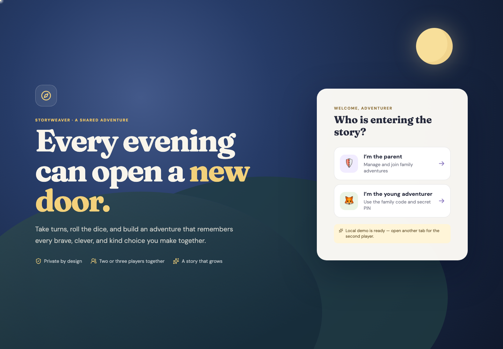
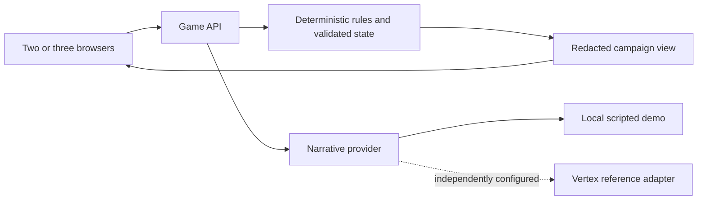

# Storyweaver

**A cooperative story adventure where the server owns the rules and AI can supply the narration.**



Built by [Mike Staniforth](https://mikestaniforth.com). This public engineering edition includes a deterministic local story provider, fictional players and a playable two-or-three-player flow.

## Play locally

Use Node 22 or 24 and pnpm 11.14.

```sh
pnpm install --frozen-lockfile
pnpm dev
```

Open http://localhost:5173 in two separate browser profiles (or a normal window and an incognito window). Choose the parent in one and a young adventurer in the other. Use the **demonstration** family code `STARLIGHT` and PIN `2468`. Every selected player must be online before starting.

The API binds to loopback in demo mode. Local sessions use in-memory state and disappear when the API restarts. No Firebase account, paid model or production family data is required. Demo credentials are fixed fictional fixtures and must never protect a real service.

## Design decisions

- Typed `TurnResolution` data connects the narrative provider to deterministic game rules.
- Server-generated rolls, turn order, state transitions and permissions stay outside model control.
- Idempotency and transactional updates prevent duplicate actions from advancing the story twice.
- Redacted client projections separate visible campaign state from the game-master model.
- Tests cover two/three-player turns, isolation, malformed model output and session restoration.



## Scope

The local narrator is deterministic demonstration logic, not a live AI model. The cloud adapter, Firebase rules, model-screening interfaces and private-media code remain as reference implementations. Production deployment scripts and real project settings are excluded. Explicitly configured cloud mode needs independent infrastructure and a separate review.

This is a local software demonstration, not an approved public service for children. Use fictional names and synthetic input. Do not upload personal family data, photos or voices to issues, fixtures or screenshots.

## Verify

```sh
pnpm format:check
pnpm lint
pnpm typecheck
pnpm test
pnpm build
pnpm --filter @family-adventure/web exec playwright install chromium
pnpm test:e2e
```

Rules integration tests additionally need Java 21 and the Firebase emulator:

```sh
pnpm exec firebase emulators:exec --project demo-storyweaver --only firestore "pnpm --filter @family-adventure/firebase-rules test"
```

See [security guidance](SECURITY.md), [AI evaluation notes](docs/ai-evaluation.md) and [source rights](SOURCE_NOTICE.md).

## Dependency review

The runtime dependency audit was clear on 23 September 2026. The optional Firebase development CLI still brings a moderate `stream-json` nested-input denial-of-service advisory. Its patched major version is incompatible with the CLI, so it is not forcibly substituted. Use the emulator with trusted local fixtures; this dependency is not included in the browser/API runtime. Recheck advisories before a release.
